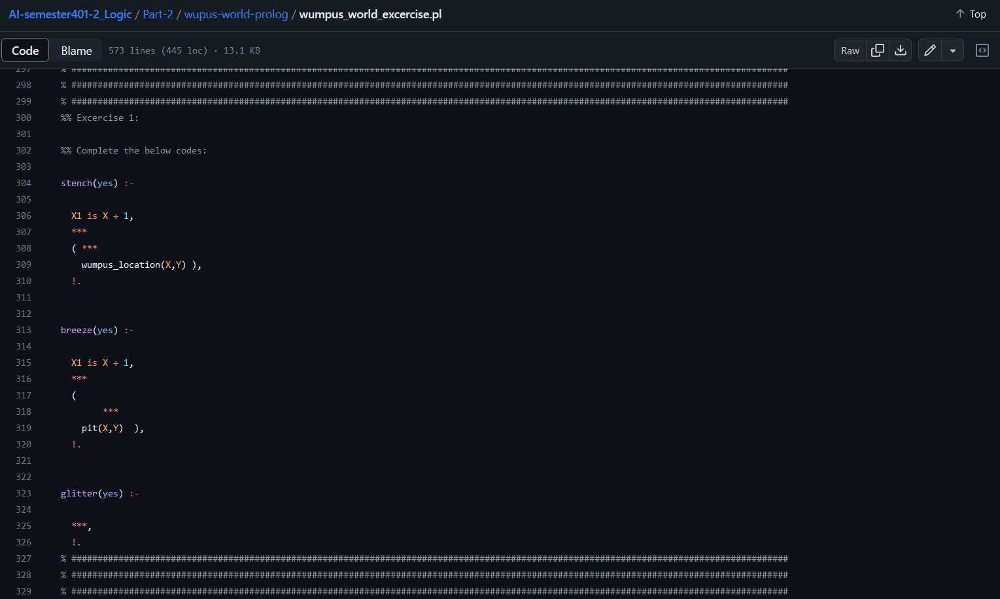
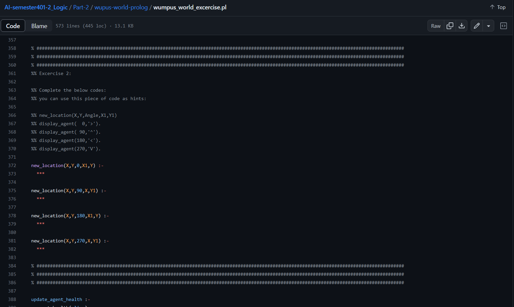

# AI-semester401-2_Logic
assignment of Logic subject of the faundamental of artificial intelligence

##  ⚡️ Quickstart - Installation and Running the program

First you should have swi-prolog installed on your computer
Then when you wanna run the code and see your code inferences' resaults, you should enter these commands first to compile, access the files and run your main program.
[First of all, download and install SWI-Prolog from here.](https://www.swi-prolog.org/download/stable)
Start SWI-Prolog in project directory:
```bash
$ swipl
```
Load the world simulator:

```bash
 ?- [wumpus_world].
```

Load the agent:

```bash
 ?- [my_agent].
```
Run the agent:

```bash
 ?- evaluate_agent(1, Score, Time).
```
Press y - You can also
run this directly:
```bash
 [wumpus_world]. [my_agent]. evaluate_agent(1, Score, Time). y
```

### List of predicates you should use

Command| Does...
:-----:|:-----:
`stench(yes) `|There is a stench.
`agent_location(X,Y)`|Agent is in room [x.y].
`wumpus_location(X,Y)`|Agent is in room [x.y].
`breeze(yes)`|There is a breeze.
`glitter(yes)`|There is a glitter.
`gold(X,Y)`|Gold is in room [x.y].

## 🎯 Where are the tasks?
* Task1





* Task2



